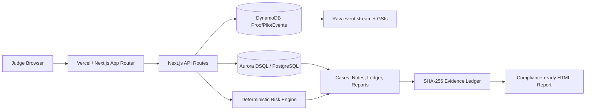

# ProofPilot AI Architecture

ProofPilot AI uses a split persistence model:

- DynamoDB stores high-volume raw suspicious events.
- Aurora DSQL/PostgreSQL stores strongly consistent workflow state.
- Vercel runs the Next.js App Router frontend and API routes.



## DynamoDB Design

Table: `ProofPilotEvents`

- `PK = ORG#organizationId`
- `SK = EVENT#timestamp#eventId`
- `GSI1PK = ENTITY#entityId`
- `GSI1SK = EVENT#timestamp`
- `GSI2PK = RISK#severity`
- `GSI2SK = timestamp#eventId`

Access patterns:

- Latest events for organization.
- Timeline for one entity.
- High/critical risk event feed.
- Event detail by ID.
- Events by severity and time.

## Aurora DSQL Schema

Migration: `lib/db/migrations/0001_initial.sql`

Tables:

- organizations
- users
- memberships
- api_keys
- entities
- cases
- case_events
- risk_scores
- evidence_ledger
- case_notes
- reports
- billing_plans

Required indexes:

- cases by organization_id and status
- cases by organization_id and severity
- risk_scores by entity_id and score
- evidence_ledger by case_id and created_at
- reports by case_id

## Evidence Ledger

Each ledger row includes:

- id
- organizationId
- caseId
- actionType
- actor
- payloadHash
- previousHash
- currentHash
- payloadJson
- createdAt

Hash formula:

```text
payloadHash = sha256(canonicalJson(payloadJson))
currentHash = sha256(previousHash + payloadHash + createdAt + actionType)
```

Verification recomputes payload and chain hashes in order and returns the exact broken record if tampering is detected.

## Security and Reliability

- No secrets are committed.
- AWS calls are server-side only.
- Inputs are validated with Zod.
- Demo data is synthetic.
- Report HTML is sanitized.
- Ingest has a rate-limit helper.
- System health does not expose secret values.

## Vercel Readiness

The app uses Next.js App Router, API routes, strict TypeScript, a production build script, and environment-variable based adapters.
