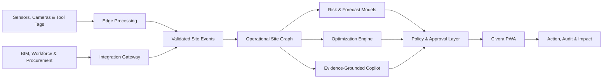

<div align="center">


# CIVORA

### Every site decision, safer, leaner, and lower-carbon.

**An AI-powered construction intelligence platform that transforms fragmented site data into explainable decisions, accountable action, and measurable impact.**

[](https://react.dev/)
[](https://www.typescriptlang.org/)
[](https://vite.dev/)
[](https://web.dev/explore/progressive-web-apps)
[](#-quality-and-testing)
[](#-quality-and-testing)

🏗️ **Construction intelligence for safer, more productive, and more sustainable projects**

</div>

---

## 🌍 The Challenge

Construction sites generate data from environmental sensors, inspections, workers, tools, schedules, cameras, and material records. Yet the people responsible for urgent decisions often receive that information through disconnected dashboards, spreadsheets, and radio calls.

The result is a difficult operating reality:

- Safety teams identify hazards without complete operational context.
- Project leaders see delays after productivity has already been lost.
- Sustainability reporting happens after decisions have been made.
- Tool condition, worker readiness, and material availability remain siloed.
- Multilingual crews may not receive consistent, verifiable briefings.

This matters at global scale. The built environment consumes **32% of global energy** and contributes **34% of global CO₂ emissions**, while construction remains one of the world's highest-risk industries.

> Civora turns disconnected signals into one decision loop:
> **Sense → Understand → Recommend → Approve → Act → Verify**

## 💡 The Solution

Civora is a construction operations command center for site managers, safety leaders, sustainability teams, workforce coordinators, and tool managers.

It combines:

- 🛡️ Predictive and explainable safety intelligence
- 🗺️ A spatial, real-time digital twin
- 🌱 Carbon budgeting and circular material workflows
- 👷 Workforce competency, fatigue, and multilingual communication
- 🔧 Connected tool health and predictive maintenance
- 📊 Evidence-backed impact and compliance reporting
- ✨ A site-aware AI copilot grounded in operational context

Civora does more than display information. It prioritizes risks, explains contributing factors, recommends practical controls, routes accountable actions, and records what changed.

## 🎯 Example Operational Workflow

At 10:22 AM, six workers are approaching an unsafe heat-exposure threshold in an MEP corridor.

Civora:

1. Detects the emerging risk across temperature, ventilation, task intensity, exposure time, and fatigue.
2. Shows a **92% confidence score** and an **18-minute intervention window**.
3. Recommends a cooling station, worker rotation, and shorter work blocks.
4. Requires a supervisor to approve the response.
5. Updates the active risk register and site action plan.
6. Preserves an auditable record of the decision.
7. Connects the intervention to safety, productivity, and financial impact.

This workflow demonstrates Civora's central principle:

> **Safety, productivity, and sustainability should reinforce one another, not compete.**

## ✨ Product Workspaces

### 🧭 Command Center

A live executive view of the site's most important decisions.

- Site safety score and active risk count
- Workforce, productivity, carbon, and project progress KPIs
- AI-prioritized intervention cards
- Persistent tasks and accountable owners
- Live operational activity stream
- Modeled monthly value creation
- Multi-project site switching

### 🗺️ Live Digital Twin

A spatial representation of people, conditions, assets, and risk.

- Interactive construction zones
- Risk, workforce, environmental, and asset layers
- Live temperature, air-quality, and noise drift
- Worker and sensor counts by zone
- Two-hour risk forecasting
- Spatial conflict and resource insights
- Privacy-preserving edge-vision demonstration

### 🛡️ Safety Intelligence

Explainable decision support for proactive site safety.

- Prioritized live risk register
- Risk-factor contribution analysis
- Confidence and data-quality indicators
- Human-in-the-loop approvals
- Likelihood × impact matrix
- Field observation reporting
- PPE scan workflow
- Emergency drill simulation
- Geofence and permit-to-work concepts
- Multilingual toolbox briefing generation

### 🌱 Carbon & Circularity

Daily construction decisions translated into climate and financial value.

- Project carbon budget
- Baseline and optimized forecast scenarios
- Embodied and operational carbon views
- Waste diversion analysis
- Water and clean-energy indicators
- Digital material passports
- Circular material matching
- Transfer reservation workflow
- Supplier sustainability scoring
- Responsible sourcing visibility

### 👷 Workforce Intelligence

Inclusive workforce planning without intrusive surveillance.

- Live crew readiness directory
- Competency and certification coverage
- Fatigue-aware shift planning
- AI-assisted shift optimization
- Microlearning recommendations
- Briefings in English, Bahasa Melayu, Tamil, Bengali, and Mandarin
- Briefing playback state and comprehension tracking
- Privacy-by-design messaging

### 🔧 Tools & Assets

Connected asset intelligence inspired by real construction workflows.

- Fleet utilization and live status
- Battery, location, and health monitoring
- Tool vibration anomaly waveform
- Predictive service recommendations
- Preventive maintenance scheduling
- Ultra-wideband location simulation
- Low-carbon charging windows
- Asset circularity and life-extension metrics

### 📊 Impact Reports

Operational evidence transformed into stakeholder-ready reporting.

- Safety, carbon, productivity, and uptime summaries
- Plain-text impact report export
- GHG Protocol, GRI, CIDB NCP 2030, and ISO 45001 mapping concepts
- Data-lineage visualization
- Immutable evidence-trail concept
- Scheduled stakeholder reports
- Confidence and methodology disclosure

## 🚀 Advanced Capabilities

Civora includes **50+ integrated product capabilities**, including:

| Intelligence | Operations | Trust & Experience |
|---|---|---|
| Predictive safety scoring | Multi-project switching | Human approval controls |
| Explainable risk factors | Persistent alerts and tasks | Transparent demo-data labels |
| Context-aware AI copilot | Real-time telemetry simulation | Data-lineage visibility |
| Carbon scenario optimization | Digital twin layers | Audit-trail concepts |
| Fatigue-aware planning | Preventive maintenance | Offline-capable PWA |
| Material circularity matching | Precision asset location | Dark and light themes |
| Tool vibration analysis | Multilingual briefings | Responsive mobile navigation |
| Two-hour risk forecasting | Report export | Reduced-motion support |

## 🏗️ Architecture



### Current Reference Implementation

The current application uses:

- A shared, strictly typed construction domain model
- Deterministic simulated telemetry updated every four seconds
- Browser persistence for alerts, tasks, projects, and theme
- Route-level lazy loading for faster initial rendering
- Workbox-powered offline caching
- No external credentials or fragile third-party runtime dependencies

### Production Evolution

The architecture is designed to replace demo adapters with verified:

- MQTT and HTTPS sensor ingestion
- BIM and geospatial data
- Workforce and competency systems
- Procurement and material records
- Connected tool and asset platforms
- Time-series storage and immutable evidence storage
- Calibrated forecasting models and constrained optimization
- Enterprise authentication, authorization, and observability

See [docs/ARCHITECTURE.md](docs/ARCHITECTURE.md) for the full production direction.

## 🧰 Technology Stack

| Layer | Technology |
|---|---|
| UI | React 19 |
| Language | TypeScript 6 |
| Build system | Vite 8 |
| Visualization | Recharts 3 |
| Icons | Lucide React |
| Offline support | Vite PWA + Workbox |
| Testing | Vitest + Testing Library |
| Styling | Custom responsive CSS design system |
| Persistence | Browser local storage |

## ⚡ Getting Started

### Prerequisites

- Node.js 20 or later
- npm 10 or later

### Install and Run

```bash
git clone https://github.com/sleader3221-dot/CIVORA.git
cd CIVORA
npm install
npm run dev
```

Open the local URL printed by Vite, normally:

```text
http://localhost:5173
```

### Production Build

```bash
npm run build
npm run preview
```

The deployable static application is generated in `dist/`.

## ✅ Quality and Testing

```bash
# Strict TypeScript validation
npm run check

# Unit and integration tests
npm run test

# Optimized production PWA build
npm run build

# Dependency vulnerability audit
npm audit
```

Current verified status:

| Quality Gate | Result |
|---|---|
| TypeScript check | ✅ Passed |
| Automated tests | ✅ 7/7 passed |
| Production build | ✅ Passed |
| npm security audit | ✅ 0 vulnerabilities |
| Route-level code splitting | ✅ Enabled |
| Offline PWA generation | ✅ Enabled |

## 🎬 Product Walkthrough

Use this path to explore the platform's connected workflows:

1. **Command Center:** introduce the heat-risk scenario.
2. **Dispatch Response:** approve the recommended intervention.
3. **Digital Twin:** select the MEP Corridor and show the two-hour forecast.
4. **Safety Intelligence:** explain the five contributing risk factors.
5. **Carbon & Circularity:** activate the AI-optimized scenario.
6. **Circular Matchmaker:** reserve the surplus plywood transfer.
7. **Tools & Assets:** schedule preventive service for the drifting grinder.
8. **Impact Reports:** export a transparent evidence report.
9. **Civora Copilot:** ask, `Find carbon savings`.

## 📈 Platform Value

| Outcome | How Civora Contributes |
|---|---|
| **Safer work** | Identifies emerging conditions, explains risk factors, and routes accountable interventions |
| **Higher productivity** | Connects workforce, schedule, zone, and asset signals to reduce avoidable disruption |
| **Lower environmental impact** | Makes carbon, energy, water, waste, and material circularity visible during operations |
| **Better asset performance** | Detects tool-health anomalies and supports preventive maintenance and charging decisions |
| **More inclusive communication** | Delivers multilingual briefings and tracks workforce comprehension |
| **Trusted reporting** | Preserves source context, methodology, confidence, approvals, and evidence lineage |

## 💼 Business Potential

### Primary Customers

- General contractors
- Large specialist subcontractors
- Property developers
- Infrastructure project operators

### Daily Users

- Site managers
- HSE and safety leads
- Sustainability managers
- Workforce coordinators
- Tool and asset managers
- Project directors

### Commercial Model

- Platform subscription per active project
- Tiered pricing by connected workers, tools, and sensors
- Enterprise integration and reporting packages
- Optional deployment, onboarding, and assurance services

### Pilot Strategy

Begin with a **6–8 week heat-risk and connected-tool pilot** on one active project. Measure:

- Alert precision and response time
- Worker heat-exposure minutes
- Unplanned tool downtime
- Supervisor adoption
- Briefing comprehension
- Avoided operational cost

## 🔐 Responsible AI, Safety, and Privacy

Civora is **decision support**, not an autonomous safety authority.

- A responsible supervisor approves all safety-critical recommendations.
- Confidence, contributing factors, and data freshness remain visible.
- Production models require prospective validation before operational use.
- Edge vision is designed to remove personal data before transmission.
- Face recognition is explicitly outside the product scope.
- Access control, retention limits, worker consultation, and audit logs are production requirements.
- Carbon and financial values require verified source data before external assurance.

> **Reference implementation disclosure:** Current telemetry, AI outputs, project values, and impact metrics are deterministic demonstration data. This implementation does not claim live production integrations, certified safety compliance, or assured carbon accounting.

## 📁 Project Structure

```text
CIVORA/
├── docs/                    # Research, architecture, features, and product materials
├── public/                  # PWA icons, redirects, and security headers
├── src/
│   ├── components/         # Shared interface primitives and application shell
│   ├── data/               # Deterministic demonstration dataset
│   ├── hooks/              # Persistence and live telemetry hooks
│   ├── lib/                # Utilities and unit tests
│   ├── test/               # Test environment setup
│   ├── views/              # Seven product workspaces
│   ├── App.tsx             # Shared application state and lazy routing
│   └── styles.css          # Complete responsive design system
├── package.json
└── vite.config.ts
```

## 📚 Project Documentation

- 🏗️ [System architecture](docs/ARCHITECTURE.md)
- ✨ [Feature matrix](docs/FEATURE_MATRIX.md)

## 🗺️ Roadmap

- [x] Integrated seven-workspace prototype
- [x] Real-time deterministic telemetry
- [x] Persistent operational workflows
- [x] Installable offline PWA
- [x] Automated tests and production build
- [ ] Conduct construction professional interviews
- [ ] Connect environmental and tool telemetry
- [ ] Add BIM and geospatial adapters
- [ ] Validate safety models prospectively
- [ ] Add enterprise identity and role-based access
- [ ] Run an instrumented live-site pilot

## 📖 Research Basis

- [UNEP Global Status Report for Buildings and Construction 2024/2025](https://www.unep.org/resources/report/global-status-report-buildings-and-construction-20242025)
- [ILO: Occupational safety and health management in construction](https://www.ilo.org/meetings-and-events/occupational-safety-and-health-management-construction-sector-3)
- [CIDB Malaysia Construction 4.0](https://www.cidb.gov.my/eng/cr-4-0/)
- [CIDB National Construction Policy 2030](https://www.cidb.gov.my/eng/national-construction-policy-ncp-2030/)
- [Hilti: Helping customers succeed with software](https://reports.hilti.group/2024/our-stories/helping-customers-succeed-with-software)

---

<div align="center">

### 🏗️ Build intelligently. Protect people. Waste less.

**Civora helps construction teams see sooner, decide better, and prove what changed.**

[Explore the Architecture](docs/ARCHITECTURE.md) · [Review the Feature Matrix](docs/FEATURE_MATRIX.md)

</div>
