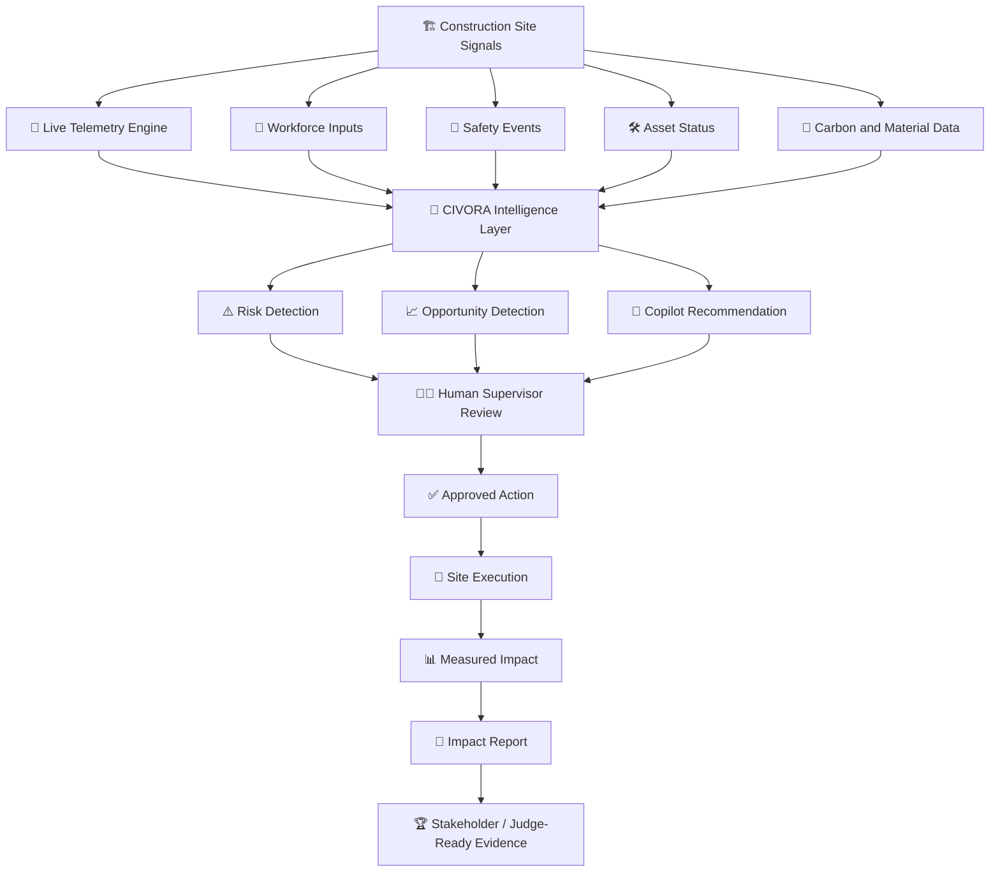
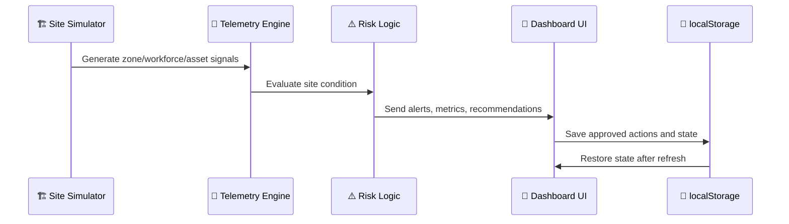

# 🏗️ CIVORA — AI-Powered Construction Site Intelligence Platform

<div align="center">

## **Build Safer. Build Smarter. Build Lower-Carbon.**

**CIVORA is an offline-ready AI construction command platform that converts scattered site signals into supervised decisions across safety, workforce, assets, carbon, digital twin visibility, and measurable impact reporting.**

<br />

[](https://react.dev/)
[](https://www.typescriptlang.org/)
[](https://vitejs.dev/)
[](https://web.dev/progressive-web-apps/)
[](https://vitest.dev/)
[](https://vercel.com/)

<br />

🚀 **Live Demo:** https://civora-zeta.vercel.app/  
💻 **Repository:** https://github.com/sleader3221-dot/CIVORA  
👨‍💻 **Built by:** [Karthik M A](https://github.com/sleader3221-dot)

</div>

---

## 📌 Table of Contents

| Section | What You’ll Find |
|---|---|
| [🌍 Problem](#-the-problem) | Why construction needs CIVORA |
| [💡 Solution](#-the-solution) | What CIVORA does differently |
| [✨ Key Features](#-key-features) | Main product capabilities |
| [🧠 Intelligence Flow](#-civora-intelligence-flow) | End-to-end decision workflow |
| [🏛️ Architecture](#️-system-architecture) | Technical structure and modules |
| [🧩 Modules](#-product-modules) | Command Center, Digital Twin, Safety, Carbon, Workforce, Assets |
| [🛠️ Tech Stack](#️-tech-stack) | React, TypeScript, Vite, PWA, Vitest |
| [⚙️ Setup](#️-installation--local-setup) | Run locally in minutes |
| [🎬 Demo Script](#-winning-demo-script) | 2–3 minute presentation flow |
| [🗺️ Roadmap](#️-roadmap) | Future production upgrades |

---

## 🌍 The Problem

Construction sites are complex, fast-moving environments where **safety, workforce, equipment, progress, material usage, carbon impact, and reporting** are often handled through disconnected tools.

| 🚧 Real Site Challenge | ❌ Current Reality | ⚠️ Impact |
|---|---|---|
| Safety risks | Detected after incidents or near misses | Injuries, delays, compliance failures |
| Workforce coordination | Managed through calls, spreadsheets, or informal updates | Idle crews, missed tasks, weak accountability |
| Equipment visibility | Asset status is often delayed or manually tracked | Downtime, overuse, poor utilization |
| Carbon decisions | Measured after work is complete | Missed reduction opportunities |
| Progress tracking | Data scattered across site teams | Slow decisions and reporting gaps |
| Connectivity | Sites may have weak or unstable internet | Cloud-only tools become unreliable |

> **Construction does not only need more dashboards — it needs an intelligent operating loop that turns signals into action.**

---

## 💡 The Solution

**CIVORA** acts as a **construction-site intelligence layer** that combines operational visibility, AI-style recommendations, digital twin context, and measurable impact reporting into one polished PWA.

### ✅ CIVORA turns this:

```text
Scattered updates → Manual follow-up → Delayed response → Weak reporting
```

### 🚀 Into this:

```text
Site signal → Risk detection → AI recommendation → Human approval → Action → Impact report
```

CIVORA is designed for **hackathon reliability, product clarity, and real-world construction relevance**. It uses deterministic telemetry and local intelligence rules so the demo remains stable, fast, and offline-friendly.

---

## 🏆 One-Line Pitch

> **CIVORA is an offline-ready AI command platform that helps construction teams detect risks, coordinate site operations, reduce carbon impact, and prove measurable outcomes — from one intelligent dashboard.**

---

## ✨ Key Features

| Feature | Description | Value |
|---|---|---|
| 🧭 **Command Center** | Central operating dashboard for site health, alerts, metrics, and quick decisions | Gives teams instant visibility |
| 🏗️ **Digital Twin View** | Zone-based construction visualization with live operational context | Converts site complexity into visual clarity |
| 🦺 **Safety Intelligence** | Detects safety risks and recommends mitigation actions | Supports proactive incident prevention |
| 👷 **Workforce Intelligence** | Tracks crew activity, allocation, readiness, and productivity signals | Reduces idle time and coordination gaps |
| 🛠️ **Tools & Assets** | Shows equipment status, utilization, maintenance needs, and availability | Improves asset planning and uptime |
| 🌱 **Carbon & Circularity** | Surfaces lower-carbon material and operation decisions | Helps teams build more sustainably |
| 📊 **Impact Reports** | Converts actions into stakeholder-ready evidence | Makes outcomes measurable and presentation-ready |
| 🤖 **CIVORA Copilot** | Local rule-based assistant for site-aware guidance and recommendations | Provides fast AI-style decision support |
| 📲 **Offline-Ready PWA** | Installable web app with cached assets and local persistence | Works better in weak-connectivity site conditions |
| 💾 **Persistent Actions** | Stores user decisions in browser localStorage | Preserves demo continuity after refresh |

---

## 🧠 CIVORA Intelligence Flow



---

## 🔁 Supervised Operating Loop

| Step | CIVORA Action | Human Role | Output |
|---|---|---|---|
| 1️⃣ Signal | Collects simulated zone, safety, workforce, asset, and carbon data | Observes site condition | Unified site context |
| 2️⃣ Detect | Identifies risks, delays, inefficiencies, or sustainability opportunities | Reviews priority | Ranked operational issue |
| 3️⃣ Recommend | Generates local AI-style suggested action | Validates recommendation | Explainable next step |
| 4️⃣ Approve | Keeps decision under human supervision | Approves or ignores action | Safe operational control |
| 5️⃣ Execute | Updates state and workflow context | Coordinates site team | Action completed |
| 6️⃣ Report | Converts decision into metrics and evidence | Shares with stakeholders | Impact report |

---

## 🏛️ System Architecture

```mermaid
flowchart LR
    subgraph UI[🎨 Frontend Experience]
        A1[Command Center]
        A2[Digital Twin]
        A3[Safety]
        A4[Workforce]
        A5[Assets]
        A6[Carbon]
        A7[Reports]
        A8[Copilot]
    end

    subgraph Logic[🧠 Local Intelligence Layer]
        B1[Telemetry Simulator]
        B2[Rule-Based Risk Engine]
        B3[Recommendation Engine]
        B4[Impact Calculator]
        B5[Persistence Manager]
    end

    subgraph Storage[💾 Browser Runtime]
        C1[localStorage]
        C2[PWA Cache]
        C3[Offline Shell]
    end

    UI --> Logic
    Logic --> Storage
    Storage --> UI
```



---

## 🧩 Product Modules

### 🧭 1. Command Center

| Capability | What It Shows | Why It Matters |
|---|---|---|
| Site Health | Overall operational status | Gives leaders instant clarity |
| Priority Alerts | High-impact risks and issues | Helps teams act faster |
| Quick Actions | Suggested operational responses | Reduces decision friction |
| Notifications | Active site events | Keeps supervisors aware |
| Command Palette | Fast navigation and action access | Improves product usability |

### 🏗️ 2. Digital Twin

| Capability | Description |
|---|---|
| Zone Mapping | Represents construction areas as operational zones |
| Status Visualization | Shows active, delayed, safe, risky, or attention-needed areas |
| Context Layer | Connects telemetry with physical construction zones |
| Demo Reliability | Simulated state changes make the system feel live and controlled |

### 🦺 3. Safety Intelligence

| Safety Layer | Purpose |
|---|---|
| Risk Detection | Surfaces unsafe or attention-needed site states |
| Mitigation Suggestions | Recommends practical next actions |
| Supervisor Review | Keeps final decisions human-approved |
| Evidence Trail | Converts safety action into reportable impact |

### 👷 4. Workforce Intelligence

| Workforce Signal | CIVORA Output |
|---|---|
| Crew availability | Better task and zone coordination |
| Productivity context | Actionable supervisor insights |
| Site readiness | Clearer allocation decisions |
| Activity patterns | Reduced idle time and missed follow-ups |

### 🛠️ 5. Tools & Assets

| Asset Problem | CIVORA Support |
|---|---|
| Idle equipment | Utilization visibility |
| Maintenance uncertainty | Readiness context |
| Delayed asset updates | Live-style dashboard state |
| Poor allocation | Better equipment planning |

### 🌱 6. Carbon & Circularity

| Sustainability Goal | CIVORA Capability |
|---|---|
| Reduce material waste | Identifies circularity opportunities |
| Lower embodied/operational carbon | Surfaces carbon-aware decisions |
| Improve accountability | Converts sustainability actions into reports |
| Support green construction | Connects operational decisions with impact |

### 📊 7. Impact Reports

| Report Category | Evidence Produced |
|---|---|
| Safety | Risks detected, actions suggested, incident-prevention narrative |
| Workforce | Allocation and productivity improvements |
| Assets | Equipment utilization and readiness insights |
| Carbon | Lower-carbon decisions and circularity opportunities |
| Overall Site | Clear stakeholder-ready impact summary |

---

## 🛠️ Tech Stack

| Layer | Technology | Why It Was Chosen |
|---|---|---|
| ⚛️ Frontend | React 19 | Modern component-based UI |
| 🧠 Language | TypeScript 6 | Safer domain models and cleaner scaling |
| ⚡ Build Tool | Vite 8 | Fast development and optimized builds |
| 📊 Charts | Recharts | Simple, clean analytics visualization |
| 🎨 Icons | Lucide React | Professional icon system |
| 📲 PWA | Vite PWA + Workbox | Offline-ready installable experience |
| 💾 Persistence | localStorage | Lightweight local demo state |
| 🧪 Testing | Vitest | Fast validation for frontend behavior |
| 🚀 Deployment | Vercel | Simple production deployment |

---

## 📂 Project Structure

```text
CIVORA/
├── public/                  # Static assets and PWA files
├── src/
│   ├── components/          # Reusable UI components
│   ├── data/                # Demo telemetry and construction domain data
│   ├── hooks/               # Custom React hooks for state and behavior
│   ├── pages/                # Main product workspaces
│   ├── types/                # TypeScript domain models
│   ├── utils/                # Intelligence rules, helpers, calculations
│   └── tests/                # Vitest tests
├── package.json             # Scripts and dependencies
├── vite.config.ts           # Vite + PWA configuration
└── README.md                # Project documentation
```

---

## 📡 Live Telemetry Model

CIVORA simulates construction site telemetry using deterministic updates. This creates a real-time product experience without depending on unstable external APIs.



| Update Cycle | What Happens |
|---|---|
| Every few seconds | Zone status and metrics refresh |
| On risk condition | Alert appears in command center |
| On user action | Decision is stored locally |
| On refresh | Previous state remains available |
| Offline mode | Core PWA shell remains usable |

---

## 🤖 CIVORA Copilot

The Copilot is designed as a **local AI-style construction assistant** for demo-safe guidance.

| Copilot Ability | Example Output |
|---|---|
| Explain site condition | “Zone B has elevated safety risk due to active work and reduced readiness.” |
| Recommend next step | “Assign supervisor review before moving heavy equipment.” |
| Summarize impact | “Action may reduce delay risk and improve safety compliance.” |
| Support demos | Gives quick, contextual product storytelling without external API failure |

> The current Copilot is rule-based for reliability. A production version can connect to guarded LLMs, RAG over site documents, BIM metadata, and real telemetry streams.

---

## ⚙️ Installation & Local Setup

### ✅ Prerequisites

| Requirement | Recommended Version |
|---|---|
| Node.js | 20+ |
| npm / pnpm | Latest stable |
| Git | Latest stable |

### 📥 Clone Repository

```bash
git clone https://github.com/sleader3221-dot/CIVORA.git
cd CIVORA
```

### 📦 Install Dependencies

```bash
npm install
```

### ▶️ Start Development Server

```bash
npm run dev
```

Open the local URL shown in terminal, usually:

```text
http://localhost:5173
```

---

## 🧪 Available Scripts

| Command | Purpose |
|---|---|
| `npm run dev` | Start local development server |
| `npm run build` | Create optimized production build |
| `npm run preview` | Preview production build locally |
| `npm run test` | Run Vitest test suite |

---

## 📲 PWA & Offline Capability

CIVORA is designed for construction environments where connectivity can be unstable.

| PWA Feature | Benefit |
|---|---|
| Installable App | Feels closer to a native field tool |
| Cached Assets | Faster repeat loading |
| Offline Shell | Demo continuity during weak internet |
| localStorage State | Preserves decisions and UI state |
| Workbox Support | Reliable service-worker caching |

---

## 🎬 Winning Demo Script

### ⏱️ 2–3 Minute Flow

| Time | Screen | What To Say |
|---|---|---|
| 0:00–0:20 | 🧭 Command Center | “Construction sites lose time, safety, and carbon efficiency because signals are scattered across teams and tools.” |
| 0:20–0:45 | ⚠️ Alerts | “CIVORA detects priority risks from live-style telemetry and highlights what needs attention first.” |
| 0:45–1:10 | 🏗️ Digital Twin | “The digital twin connects alerts to actual site zones so supervisors understand where and why action is needed.” |
| 1:10–1:35 | 🦺 Safety | “Instead of waiting for incidents, CIVORA recommends mitigation actions under human supervision.” |
| 1:35–2:00 | 👷 Workforce + 🛠️ Assets | “The same command layer coordinates crews and equipment to reduce idle time and delays.” |
| 2:00–2:25 | 🌱 Carbon | “CIVORA also brings sustainability into daily decisions, not only end-of-project reporting.” |
| 2:25–3:00 | 📊 Impact Reports | “Every decision becomes measurable evidence for stakeholders, compliance, and sustainability goals.” |

### 🏁 Closing Line

> **CIVORA is not just a construction dashboard — it is a supervised intelligence loop that turns site signals into safer decisions, lower-carbon operations, and measurable impact.**

---

## 🏆 Hackathon / Judge Positioning

| Judging Angle | CIVORA Strength |
|---|---|
| Innovation | Combines construction digital twin, safety intelligence, carbon decisions, workforce, assets, and impact reports |
| Feasibility | Built as a working React + TypeScript + PWA product |
| Real-World Relevance | Targets construction safety, delays, sustainability, and fragmented reporting |
| Technical Execution | Typed architecture, deterministic telemetry, local persistence, PWA caching, tests |
| Demo Reliability | No dependency on unstable external AI APIs for core flow |
| Impact | Improves safety, efficiency, accountability, and sustainability visibility |

---

## 🔥 What Makes CIVORA Different

| Traditional Construction Dashboard | CIVORA |
|---|---|
| Shows static information | Generates live-style operational intelligence |
| Focuses on reporting after work | Supports decisions during work |
| Separate safety, carbon, workforce, and asset tools | Unified site intelligence layer |
| Requires constant internet | Offline-ready PWA shell |
| Displays data only | Recommends action and tracks impact |
| Hard to demo reliably | Deterministic telemetry for stable presentation |
| Weak accountability | Converts actions into impact evidence |

---

## 📈 Impact Metrics CIVORA Can Demonstrate

| Metric Area | Example Measurable Outcome |
|---|---|
| 🦺 Safety | Faster detection of high-risk zones |
| 👷 Workforce | Reduced idle time through better allocation visibility |
| 🛠️ Assets | Improved equipment readiness and utilization awareness |
| 🌱 Carbon | More carbon-aware daily construction choices |
| 📊 Reporting | Faster stakeholder-ready summaries |
| 🧭 Operations | Stronger supervisor decision clarity |

---

## 🗺️ Roadmap

| Phase | Upgrade | Description |
|---|---|---|
| ✅ Current | Demo-ready PWA | Frontend-first, offline-ready, deterministic telemetry |
| 🔜 Phase 1 | Backend API | Add database, authentication, role-based access |
| 🔜 Phase 2 | Real IoT Streams | Connect sensors, equipment trackers, and worker systems |
| 🔜 Phase 3 | BIM Integration | Ingest BIM/site models for richer digital twin intelligence |
| 🔜 Phase 4 | Advanced AI | Add anomaly detection, forecasting, and guarded LLM Copilot |
| 🔜 Phase 5 | Enterprise Reports | PDF exports, compliance logs, carbon accounting integrations |
| 🔜 Phase 6 | Multi-Site Admin | Manage multiple construction projects from one command layer |

---

## 🧪 Testing

Run tests using:

```bash
npm run test
```

Testing helps validate core UI behavior and improves confidence during fast hackathon iteration.

---

## 🚀 Deployment

Build the project:

```bash
npm run build
```

Preview production build:

```bash
npm run preview
```

Deploy easily on:

| Platform | Supported |
|---|---|
| Vercel | ✅ Recommended |
| Netlify | ✅ Supported |
| GitHub Pages | ✅ Possible with config |
| Static Hosting | ✅ Supported after build |

---

## 🖼️ Screenshots

Add screenshots inside a `/screenshots` folder and update the links below:

```md


```

Recommended screenshot order for GitHub:

| Order | Screenshot | Purpose |
|---|---|---|
| 1 | Command Center | First impression and product overview |
| 2 | Digital Twin | Visual intelligence proof |
| 3 | Safety Intelligence | Real-world impact |
| 4 | Carbon & Circularity | Sustainability alignment |
| 5 | Impact Reports | Evidence and stakeholder value |

---

## 🏷️ Suggested Repository Topics

```text
construction-tech
smart-construction
sustainability
safety-intelligence
digital-twin
carbon-intelligence
workforce-management
asset-management
pwa
react
typescript
vite
hackathon
impact-reporting
```

---

## 👨‍💻 Author

**Karthik M A**  
GitHub: [@sleader3221-dot](https://github.com/sleader3221-dot)

---

## 📜 License

This project is currently intended for learning, demonstration, portfolio, and hackathon evaluation.

---